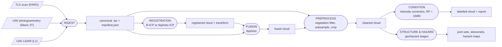

# LithoCloud — Architecture Design (v1.0 — approved)

*The project was called **rockslope-studio** until 2026-08-27, when it was renamed to LithoCloud (package `rockslope_studio` → `lithocloud`). Nothing in this design changed with the name; run folders, provenance and manifests written before the rename remain valid and untouched.*

*Approved by Mohammad on 2026-08-26. Implementation follows the session plan in §13. Rule 2 stands permanently: any logic change to existing pipelines requires his separate explicit confirmation, every time.*

---

## 1. Purpose

One light desktop application that hosts all of your point-cloud methods as independent **engines**. You can change, split, or completely rewrite any engine without touching the UI or the other engines. The app runs on your Dell Precision (Windows 11, 16 GB RAM), and all code lives on GitHub.

## 2. Your rules (locked into this design)

1. **No code is generated before your permission.** Design documents first, approval, then implementation.
2. **No logic change without your explicit confirmation** — ever, in any session.
3. **Every restructuring must prove equivalence**: old code and new code run on the same sample data and must produce identical outputs before the old code is retired.
4. **Small sessions, one module each**: every Claude Code session works on exactly one package and never edits files outside it.

## 3. The big picture

Three concepts, strictly separated:

| Concept | What it is | What it must never do |
|---|---|---|
| **Shell** (the app) | PySide6 window: project browser, engine forms, job runner, viewers | Contains **zero** science logic |
| **Engine** | One of your pipelines, wrapped behind a small manifest | Never imports the UI, never calls another engine directly |
| **Artifact** | A result file (+ provenance record) in the project workspace | — |

Engines communicate **only through artifacts**. The shell communicates with engines **only through the manifest and subprocess calls**. This is why swapping an engine can never break anything else.

### Approved dataflow



Chains are **not** hard-wired: any engine can take any *compatible* artifact as input (e.g., geohazard can run directly on a raw ingested cloud).

## 4. Project workspace (your conventions, promoted)

A *project* is one site (e.g., Francon, Camillien-Houde). Its folder:

```
<project>/
├── raw/                          original files — the app never modifies them
├── runs/
│   └── 2026-08-26_1432_ricp/     one folder per engine run (never overwritten)
│       ├── ...output files
│       ├── manifest.json         engine, version, all parameters, decisions
│       └── _DONE.json            completion marker
└── project.json                  site name, CRS, list of artifacts
```

This is exactly the `runs/<timestamp>/` + `manifest.json` + checkpoint pattern that **geohazard-pipeline and ricp already use today** — generalized to all engines. Every output file the app knows about is an **artifact** with recorded lineage: which engine, which version, which parameters, which input artifacts. The app can therefore always show the true flowchart of how any result was produced (reproducibility for your papers).

**Artifact types (v1):** `pointcloud` (.las/.laz) · `transform` (4×4, .json) · `table` (.csv) · `figure` (.png/.svg) · `map` (.tif/.png) · `report` (.md/.json) · `model` (.joblib — RF/GMM).

## 5. The engine contract

Each engine is described by one `engine.yaml` manifest. Example (illustrative):

```yaml
id: ricp
name: R-ICP Registration
version: 1.0.0
actions:
  - id: register
    label: Register two clouds (R-ICP)
    inputs:
      - {key: reference, type: pointcloud}
      - {key: align,     type: pointcloud}
    outputs:
      - {key: registered, type: pointcloud}
      - {key: transform,  type: transform}
    params: params_register.json     # names, defaults, ranges, help text
run:
  command: "{python} -m ricp {action} ..."
```

How the shell uses it:

1. **Discovery** — at startup the shell scans for manifests. Adding an engine = adding a folder. Removing = removing it. No UI code changes.
2. **Auto-forms** — the parameter form is *generated* from `params_*.json` (defaults, ranges, tooltips). Engine screens are never hand-written.
3. **Input pickers** — filled automatically with compatible artifacts from the project.
4. **Execution** — the engine runs as a **subprocess**. Benefits on 16 GB RAM: a crashing engine cannot crash the app; memory is fully released after each run; an engine could get its own environment if dependencies ever conflict.
5. **Progress** — the engine prints simple progress lines; the shell shows them. Your pipelines already print structured progress, so v1 can simply display their output live.

**Actions:** one engine may declare several actions (like geohazard's stages). This directly supports your wish to later split R-ICP into smaller actions (coarse-align → overlap-crop → recursive-filter → polish): that is only a manifest change plus your approved refactor — the UI adapts automatically.

## 6. Mapping your five engines

| Engine | Source | State today | Wrap plan (v1) |
|---|---|---|---|
| **tlsphoto** | `Projects/tlsphoto` (own GitHub repo) | Mature package, tests, CLI, SPEC v0.5 | Manifest only — actions: `ingest`, `register`, `fuse`, `compare`, `topview`. **No restructuring.** |
| **ricp** | `Projects/ricp/ricp` (own GitHub repo) | One 2,916-line file + frozen spec + tests | First wrap **as-is** (manifest around `ricp.py`). Package split later, per `PHASE1_FROZEN_SPEC.md`, with the equivalence gate. |
| **geohazard** | `Projects/geohazard-pipeline` (own GitHub repo) | Staged package with run manager | Manifest only — its 6 stages become 6 actions; `--resume`/`--redo` mapped to buttons. **No restructuring.** |
| **condition** | `Projects/condition_classification` (2 scripts, no repo yet) | `Intensity_correction_l1_v6.py`, `Gmm_interactive_v8.3.py` | New engine package with actions `intensity_correction` and `gmm_clustering`; scripts moved in **unchanged**, split into a package only after equivalence testing. |
| **preprocess** | Not yet coded (vegetation filter GLI+roughness, subsample, crop, convert) | Ideas + chat work | New engine, specified fresh — the only engine written from scratch. |

Note: the flowchart's **INGEST** box is tlsphoto's `ingest` action (it already produces the canonical self-describing LAZ). Other engines keep their own readers for now — no forced rewrites; convergence on the canonical format can happen gradually, engine by engine, with your approval.

## 7. Interactive steps (important)

Several of your pipelines are interactive by design: column mapping and north confirmation (geohazard), SCENE-style point picking (ricp), boundary editor and expert mapping (GMM v8.3).

**v1 strategy: keep them exactly as they are.** The shell launches the engine in a console window (or attached terminal panel), and the engine's own dialogs / matplotlib windows appear as they do today. Zero logic change, zero risk.

**Later (optional, per engine, with your approval):** migrate specific prompts into Qt dialogs through a small question/answer protocol. The design leaves room for this but does not require it.

## 8. The shell (PySide6)

Layout (single window, three zones):

```
┌────────────┬──────────────────────────────┬────────────────┐
│ PROJECT    │  ENGINE PANEL                │ RESULTS        │
│ artifacts  │  engine ▸ action ▸ auto-form │ 3D viewer      │
│ (lineage   │  [Run]  progress / log       │ figures/tables │
│  tree)     │  job history                 │ report view    │
└────────────┴──────────────────────────────┴────────────────┘
```

Viewers, in priority order:

1. **Figures & tables** (v1): stereonets, histograms, reports, CSVs — cheap and covers most daily checking.
2. **3D viewer** (v1 or v2 — Decision D3): PyVista embedded in Qt. It always renders a **decimated display copy** (~2–5 M points max, built once per artifact); full clouds (your TLS sets reach ~200 M points) are never loaded into the viewer. "Open in CloudCompare" button as the escape hatch for deep inspection.

Jobs: one engine run at a time by default (16 GB RAM), queued if you start more.

## 9. Repository strategy — Decision D1

You chose "one repo, many packages". The inventory then showed that tlsphoto, ricp and geohazard already have their **own GitHub repos**. Two honest options:

**Option A — recommended: monorepo + sibling repos.**
`LithoCloud` (new repo) contains the shell, the manifests/adapters for the three existing pipelines, and the two new engines. tlsphoto, ricp and geohazard **stay in their own repos**, side by side in `Projects/`, found by local path:

```
Projects/
├── lithocloud/            ← NEW repo (github.com/MohammadNiknezhad/lithocloud)
│   ├── CLAUDE.md                ← rules for every Claude Code session
│   ├── app/                     ← the shell (lithocloud package)
│   ├── engines/
│   │   ├── tlsphoto/            ← engine.yaml + thin adapter only (code stays in ../../tlsphoto)
│   │   ├── ricp/                ← engine.yaml + adapter (code stays in ../../ricp/ricp)
│   │   ├── geohazard/           ← engine.yaml + adapter (code stays in ../../geohazard-pipeline)
│   │   ├── condition/           ← FULL engine package (new home for the 2 scripts)
│   │   └── preprocess/          ← FULL engine package (new)
│   ├── docs/                    ← this document + one spec per engine
│   └── data_samples/            ← small test clouds for equivalence checks
├── tlsphoto/                    ← unchanged, own repo, own versions
├── ricp/                        ← unchanged, own repo, own versions
├── geohazard-pipeline/          ← unchanged, own repo, own versions
└── condition_classification/    ← retired after the scripts move into the monorepo
```

Why A: your mature repos keep their history, versions, and independence (citable in papers); a Claude Code session on one pipeline works inside that repo only — the smallest possible session; the studio pins which version of each pipeline it uses.

**Option B — everything moves into the monorepo.** One single repo to manage; the three existing repos become archives. Simpler bookkeeping, but uproots working repos and makes their history second-class.

## 10. Environments — Decision D2

All five engines use the same scientific stack (numpy, scipy, pandas, matplotlib, laspy[lazrs], scikit-learn; pyproj optional). **Recommendation: one conda env (`rockslope`) for everything, defined in one `environment.yml`.** The subprocess design means a per-engine env can be added later in minutes if a conflict ever appears — nothing needs redesign.

## 11. The no-logic-change protocol (how rule 2 and 3 are enforced)

For every restructuring (e.g., splitting `ricp.py`, packaging the condition scripts):

1. Freeze small sample inputs in `data_samples/` (you choose them — real but small).
2. Run the **old** code on the samples; store outputs as the golden reference.
3. Restructure with **zero** algorithm edits (imports and file moves only). Fixed random seeds where randomness exists.
4. Run the **new** package on the same samples; outputs must match (bit-identical, or documented numeric tolerance where floating-point order changes).
5. Only then is the old entry point retired — and the old file stays in git history forever.
6. Any *intentional* logic change is a separate step, proposed to you in writing first, approved by you, then implemented and re-verified.

## 12. CLAUDE.md (draft content — the rules every Claude Code session reads)

- You work ONLY inside the one package named in your task. Never edit files outside it.
- NEVER change algorithm logic, parameter defaults, or numeric behaviour without Mohammad's explicit confirmation in this session.
- Restructuring must pass the equivalence protocol (docs/architecture.md §11) before the old path is removed.
- Engines never import the shell or other engines; the shell never imports engine internals. Communication is only: manifest → subprocess → artifacts.
- Read `docs/specs/<your-module>.md` before writing anything. If the spec is unclear, ask — do not guess.
- Small commits with clear messages; never force-push; never touch `main` of the three external pipeline repos without being asked.

## 13. Implementation plan — small Claude Code sessions, one module each

| # | Session | Produces |
|---|---|---|
| 1 | Scaffold | `LithoCloud` repo, CLAUDE.md, folder structure, environment.yml, tiny artifact/provenance library |
| 2 | Shell core | Project open/create, engine discovery, auto-forms, subprocess job runner, log panel — first working window |
| 3 | Wrap tlsphoto | engine.yaml + adapter, actions ingest/register/fuse — first real engine visible in the UI |
| 4 | Wrap geohazard | 6 stage-actions with resume/redo |
| 5 | Wrap ricp (as-is) | Manifest around ricp.py, interactive picking untouched |
| 6 | Condition engine | Two scripts moved in unchanged + manifest (equivalence-checked) |
| 7 | Preprocess engine | New: vegetation filter (GLI + roughness), subsample, crop, convert — from a spec we write together |
| 8 | Results viewers | Figures/tables/report panels (+ 3D viewer if D3 = v1) |
| 9 | ricp package split | The 2,916-line file becomes a package per PHASE1_FROZEN_SPEC.md + equivalence gate |

Each session: starts from its spec in `docs/specs/`, ends with tests green and your review. Order of 3–9 is flexible.

## 14. Decisions (resolved 2026-08-26)

- **D1** — Option A: tlsphoto, ricp and geohazard keep their own repos beside `LithoCloud`; the monorepo holds the shell, the adapters, and the condition + preprocess engines.
- **D2** — One shared conda env (`rockslope`) from one `environment.yml`; per-engine envs only if a conflict ever appears.
- **D3** — Embedded 3D viewer deferred to v2. v1 ships figures/stereonets/tables/reports + an "Open in CloudCompare" button.
- **D4** — The app **asks the user** where each project workspace lives: chosen in the project-creation dialog, stored in `project.json`, remembered per project. No hard-coded location.

## 15. What "approval" means

When you approve this document (with any changes you want):

- I write the per-engine spec documents (still design, no code).
- Session 1 (scaffold) becomes ready for you to run in Claude Code.
- Code is then written **only** inside those sessions, one module at a time, under the CLAUDE.md rules above.
- Any change to the logic of your existing pipelines will still be proposed to you explicitly, every single time.

## 16. Amendment A1 (2026-08-27) — input slots accept files from disk

**Problem found in use.** Input pickers offered only artifacts already in the
project, so the first run of a new project had nothing to pick: with an empty
project the reference/align combos of ricp are empty and Run reports "Choose an
artifact for input 'reference' first" — a dead end either way (corrected
2026-08-27: the button is enabled, the message appears on click).
The geohazard `in_file` parameter was a per-engine workaround; typing full
paths into a text box is not the interface Mohammad wants.

**Decision (Mohammad, 2026-08-27).** Every input slot gets a file chooser.
The picker offers, in one control: the project's compatible artifacts **and**
a "Browse..." button opening a normal Windows file dialog. A browsed file is
used by absolute path, exactly like an artifact's file.

**Rules.**

* The file dialog filters by the slot's artifact type (pointcloud →
  `*.las *.laz *.txt *.xyz *.csv *.pts *.asc`, transform → `*.json *.txt`,
  table → `*.csv`, ...) with an "All files" fallback; the last folder used is
  remembered per project.
* Raw files are **never copied or modified**. The run manifest and the output
  artifacts' provenance record an external input as its absolute path (an
  input id that resolves to no artifact — `artifacts.parents_of` already
  returns such ids as unresolved, by design), so lineage still shows where a
  result came from.
* Engine manifests and adapters are unaffected: they receive a file path per
  input key, whatever its origin. Per-engine raw-path parameters (geohazard's
  `in_file`) stay valid but stop being the normal route.
